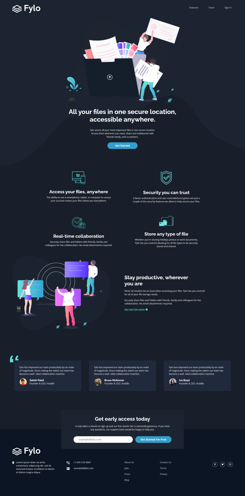

# Frontend Mentor - Fylo dark theme landing page solution

This is a solution to the [Fylo dark theme landing page challenge on Frontend Mentor](https://www.frontendmentor.io/challenges/fylo-dark-theme-landing-page-5ca5f2d21e82137ec91a50fd). Frontend Mentor challenges help you improve your coding skills by building realistic projects.

## Table of contents

- [Overview](#overview)
  - [The challenge](#the-challenge)
  - [Screenshot](#screenshot)
  - [Links](#links)
- [My process](#my-process)
  - [Built with](#built-with)
- [Author](#author)

## Overview

### The challenge

Users should be able to:

- View the optimal layout for the site depending on their device's screen size
- See hover states for all interactive elements on the page

### Screenshot

### Links

- Solution URL: [GitHub](https://github.com/nkp1111/frontend-mentor-challenges/tree/main/fylo-dark-theme-landing-page)
- Live Site URL: [Netlify](https://nkp1111-fylo-dark-theme-landing-page.netlify.app/)

## My process

### Built with

- Semantic HTML5 markup
- CSS custom properties
- Flexbox
- CSS Grid
- [React](https://reactjs.org/) - JS library
- Bootstrap
- React-icons

## Author

- Website - [Neeraj Parmar](https://www.your-site.com)
- Frontend Mentor - [nkp1111](https://www.frontendmentor.io/profile/nkp1111)
- Twitter - [@nkp11111507](https://twitter.com/home)
